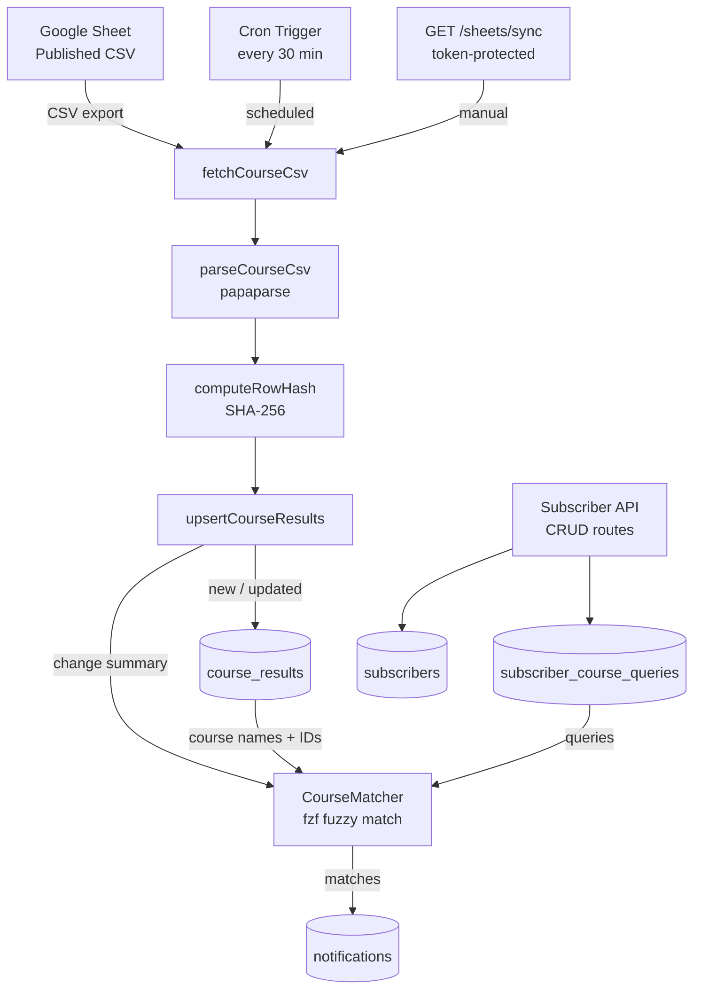

# NPTEL Notifier: Backend Publisher

A Cloudflare Worker that periodically reads NPTEL course results from a published Google Sheet, matches new or changed courses against subscriber interests using fuzzy matching, and dispatches notifications (coming soon).

## Architecture



## Data Flow

1. **Fetch**: Cron (every 30 min) or manual `GET /sheets/sync` triggers a CSV fetch from the published Google Sheet.
2. **Parse**: `papaparse` handles the NPTEL sheet format — preamble notes, multi-line quoted fields, 13-column layout.
3. **Hash**: Each row gets a SHA-256 `row_hash` over its changeable columns (course name + dates). The course ID from the sheet (`noc26-cy39`) is used as the natural primary key — no synthetic IDs needed.
4. **Upsert**: Rows are compared against `course_results`:
   - New course ID → `INSERT` with `first_seen_at = now`
   - Existing, hash changed → `UPDATE` with `updated_at = now`
   - Existing, hash unchanged → skip
5. **Match**: `CourseMatcher` (fzf algorithm) indexes all course names and IDs. Each subscriber query is scored against the full index. Matches above a score threshold are returned grouped by subscriber.
6. **Notify** (coming): Matches are written to `notifications` with deduplication, then dispatched to the subscriber's contact.

## Design Decisions

| Decision                                        | Rationale                                                                                                                                                           |
| ----------------------------------------------- | ------------------------------------------------------------------------------------------------------------------------------------------------------------------- |
| **Public CSV export** over Sheets API           | No authentication needed. The sheet is published publicly by NPTEL.                                                                                                 |
| **papaparse** for CSV parsing                   | Handles multi-line quoted fields (the Score Calculation Logic column spans 3+ lines). Pure JS, zero dependencies, works in Workers.                                 |
| **Natural course_id from CSV**                  | The sheet already provides stable IDs (`noc26-cy39`). No need to generate synthetic IDs.                                                                            |
| **SHA-256 row_hash** for change detection       | Deterministic, collision-resistant. Hashed columns are the changeable ones (name + dates), not identifiers.                                                         |
| **fzf algorithm** for fuzzy matching            | Character-level matching rewards queries whose characters appear in order in the target. Supports both course name and course ID matching via combined search text. |
| **Combined ID + name index**                    | A subscriber can search `"noc26-cy39"` or `"symmetry stereo"` — both route through the same Fzf instance with `selector: (c) => \`${c.id} ${c.name}\``.             |
| **Token-protected sync endpoint**               | `GET /sheets/sync` requires a `SYNC_SECRET` (Bearer header or query param). Cron bypasses this — it calls `syncSheet` directly.                                     |
| **vitest-pool-workers**                         | Tests run inside the actual `workerd` runtime with a real D1 database. No mocks needed for D1 operations.                                                           |
| **Secrets via `.dev.vars` / `wrangler secret`** | `CSV_URL` and `SYNC_SECRET` never touch `wrangler.toml`. Locally: `.dev.vars` (gitignored). Production: `wrangler secret put`.                                      |

## Database Schema

### `subscribers`

| Column          | Type          | Notes                                     |
| --------------- | ------------- | ----------------------------------------- |
| `id`            | TEXT PK       | UUID                                      |
| `contact_type`  | TEXT NOT NULL | e.g. `"email"`, `"webhook"`, `"telegram"` |
| `contact_value` | TEXT NOT NULL | The address/destination                   |
| `created_at`    | TEXT NOT NULL | ISO 8601                                  |

### `subscriber_course_queries`

| Column          | Type          | Notes                                                     |
| --------------- | ------------- | --------------------------------------------------------- |
| `id`            | TEXT PK       | UUID                                                      |
| `subscriber_id` | TEXT NOT NULL | FK → `subscribers(id)` ON DELETE CASCADE                  |
| `course_query`  | TEXT NOT NULL | Freeform search string (e.g. `"algebra"`, `"noc26-cs01"`) |
| `created_at`    | TEXT NOT NULL | ISO 8601                                                  |

UNIQUE on `(subscriber_id, course_query)`. Indexed on `subscriber_id`.

### `course_results`

| Column                        | Type          | Notes                                      |
| ----------------------------- | ------------- | ------------------------------------------ |
| `course_id`                   | TEXT PK       | Natural ID from sheet, e.g. `"noc26-cy39"` |
| `serial_number`               | INTEGER       | Row number in the sheet                    |
| `course_name`                 | TEXT NOT NULL | e.g. `"Cloud Computing"`                   |
| `scores_published_on`         | TEXT          | Date string from column J                  |
| `certificates_available_on`   | TEXT          | Date string from column K                  |
| `score_issue_report_deadline` | TEXT          | Date string from column L                  |
| `row_hash`                    | TEXT NOT NULL | SHA-256 of changeable columns              |
| `first_seen_at`               | TEXT NOT NULL | When the course first appeared             |
| `updated_at`                  | TEXT NOT NULL | Last time the row changed                  |

### `notifications`

| Column              | Type          | Notes                                                 |
| ------------------- | ------------- | ----------------------------------------------------- |
| `id`                | TEXT PK       | UUID                                                  |
| `subscriber_id`     | TEXT NOT NULL | FK → `subscribers(id)`                                |
| `course_id`         | TEXT NOT NULL | FK → `course_results(course_id)`                      |
| `notification_type` | TEXT NOT NULL | e.g. `"scores_published"`, `"certificates_available"` |
| `sent_at`           | TEXT NOT NULL | ISO 8601                                              |

UNIQUE on `(subscriber_id, course_id, notification_type)` — prevents duplicate notifications.

## API Routes

| Method | Path                              | Auth  | Description                                                          |
| ------ | --------------------------------- | ----- | -------------------------------------------------------------------- |
| `GET`  | `/health`                         | —     | Service health check                                                 |
| `GET`  | `/db/health`                      | —     | D1 connectivity check                                                |
| `GET`  | `/subscribers`                    | —     | List all subscribers                                                 |
| `POST` | `/subscribers`                    | —     | Create a subscriber                                                  |
| `GET`  | `/subscribers/:id/course-queries` | —     | List course queries for a subscriber                                 |
| `POST` | `/subscribers/:id/course-queries` | —     | Add a course query to a subscriber                                   |
| `GET`  | `/sheets/sync`                    | Token | Manually trigger a sheet sync. Returns `{ new, updated, unchanged }` |

**Creating a subscriber:**

```bash
curl -X POST https://<worker>/subscribers \
  -H "Content-Type: application/json" \
  -d '{"contactType":"email","contactValue":"alice@example.com"}'
```

**Adding a course query:**

```bash
curl -X POST https://<worker>/subscribers/<subscriber-id>/course-queries \
  -H "Content-Type: application/json" \
  -d '{"courseQuery":"algebra"}'
```

**Triggering a sync:**

```bash
curl -H "Authorization: Bearer <secret>" \
  https://<worker>/sheets/sync
```

## Project Structure

```
backend-publisher/
├── src/
│   ├── index.ts            # Worker entry point, route dispatch, scheduled handler
│   ├── constants.ts        # SQL queries, error strings, HTTP constants
│   ├── routes.ts           # Route enum and path matchers
│   ├── http.ts             # JSON response helper
│   ├── validation.ts       # Zod schemas and validation error formatting
│   ├── subscribers.ts      # Subscriber CRUD (list, create)
│   ├── courseQueries.ts    # Course query CRUD per subscriber
│   ├── sheets.ts           # CSV fetch → parse → hash → upsert pipeline
│   ├── matching.ts         # Fzf-based fuzzy course matcher
│   └── utils/
│       └── request.ts      # Request method/route helpers
├── test/
│   ├── tsconfig.json       # Test-specific TypeScript config
│   ├── apply-migrations.ts # D1 migration runner for tests
│   ├── subscribers.test.ts # Subscriber API integration tests
│   └── matching.test.ts    # Fuzzy matching unit tests
├── migrations/
│   └── 0001_initial.sql    # Database schema
├── wrangler.toml           # Cloudflare Worker config
├── vitest.config.ts        # Vitest + vitest-pool-workers config
├── AGENTS.md               # Agent guidance
└── PLAN.md                 # Original build plan
```

## Setup

```bash
# Install dependencies
pnpm install

# Apply local D1 migrations
pnpm db:migrate:local

# Set up local secrets (never committed)
cat > .dev.vars << EOF
CSV_URL = "https://docs.google.com/spreadsheets/d/e/.../pub?gid=0&single=true&output=csv"
SYNC_SECRET = "your-secret-here"
EOF

# Start dev server
pnpm dev
```

## Testing

Tests run inside the actual Cloudflare Workers runtime via `@cloudflare/vitest-pool-workers`. Each test file gets an isolated D1 database with migrations applied automatically.

```bash
# Watch mode (development)
pnpm test

# Single run (CI)
pnpm test:run
```

## Deployment

```bash
# Apply D1 migrations to Cloudflare
pnpm db:migrate:remote

# Set production secrets
npx wrangler secret put CSV_URL
npx wrangler secret put SYNC_SECRET

# Deploy
pnpm run deploy
```
